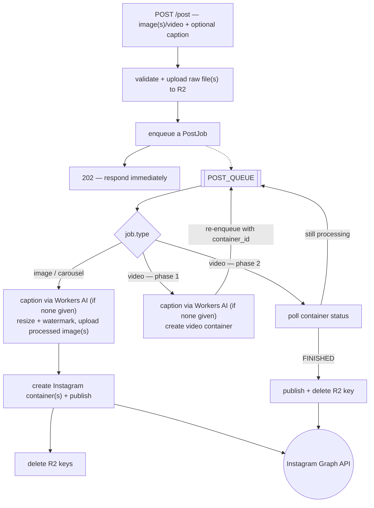

# cf-ai-social-publisher

> **Why does this exist?** I'm a geek with a cat named Loli who has her own Instagram, [@lola_la_sheriff](https://instagram.com/lola_la_sheriff/), and I wanted a stupidly simple way to fire off a photo from an iPhone Shortcut (or [HTTP Shortcuts](https://play.google.com/store/apps/details?id=ch.rmy.android.http_shortcuts) on Android) and have it show up on her feed with a caption. If you want something polished and out-of-the-box, use [Postiz](https://postiz.com/) instead — more powerful, way more usable. This is for people who'd rather tinker: full control over the prompts, no SaaS in the middle, and an excuse to poke at Cloudflare's Workers AI free tier.

A Cloudflare Workers toolkit for publishing to social media with AI-generated captions: a vision model describes the photo/video, an LLM writes the caption in your voice, then it publishes for you. Ships today with full Instagram support — the publishing layer is small and swappable (see [Escape hatch](#escape-hatch-building-blocks)), so a second provider is a contained addition, not a rewrite.

- **Publishing**: Instagram Graph API — photos, carousels (up to 10 images), videos/Reels, token refresh. Every post type is queued: `/post` uploads the raw file(s) and returns immediately, a single queue does all the AI captioning, image processing, and Instagram container creation/polling/publishing off the request thread.
- **Captions**: vision model describes the scene, an LLM writes it in your persona's voice.
- **Image processing**: resize, optional HDR, watermark.
- **Video**: frame extraction (Browser Rendering) + audio transcription (Whisper), both fed into the caption prompt.
- **`createInstagramWorker(config)`**: a full Worker — health check, auth, `/caption`, `/preview`, `/post`, post-processing queue — in ~10 lines.

## Architecture

`/post` only validates the request, uploads the raw file(s) to R2, and enqueues a job — every post type (image, carousel, video) is processed the same way, off the request thread. Video needs two passes through the queue because Instagram's own processing takes minutes: phase 1 creates the container, phase 2 polls it until it's ready to publish.



## Quick start

Requirements: a Cloudflare account (Workers AI, R2, Queues, Browser Rendering — all free tier) and an API token with `Workers R2 Storage:Edit` + `Workers Queues:Edit` ([create one](https://dash.cloudflare.com/profile/api-tokens)).

```bash
export WORKER_NAME="my-instagram-worker"
export CLOUDFLARE_ACCOUNT_ID="your-account-id"      # dash.cloudflare.com → right sidebar
export CLOUDFLARE_API_TOKEN="your-token-with-r2-and-queues-permissions"

# 1. Scaffold with Cloudflare's official CLI
npm create cloudflare@latest "$WORKER_NAME" -- --type hello-world --lang ts --no-deploy --no-git
cd "$WORKER_NAME"
rm -f wrangler.jsonc src/index.ts

# 2. C3 templates pin an old Wrangler (v3) whose Queues API call fails —
#    "The specified queue settings are invalid." Upgrade first.
npm install -D wrangler@4

# 3. Install this library
npm install cf-ai-social-publisher

# 4. Generate wrangler.jsonc and provision the Cloudflare resources
BUCKET="${WORKER_NAME}-images"
QUEUE="${WORKER_NAME}-post-queue"

cat > wrangler.jsonc <<EOF
{
	"name": "${WORKER_NAME}",
	"main": "src/index.ts",
	"compatibility_date": "$(date +%Y-%m-%d)",
	"compatibility_flags": ["nodejs_compat"],
	"account_id": "${CLOUDFLARE_ACCOUNT_ID}",
	"vars": {
		// TODO: replace with your real Instagram Business Account ID (Meta for Developers)
		"INSTAGRAM_BUSINESS_ACCOUNT_ID": "REPLACE_ME",
		"R2_PUBLIC_URL": "REPLACE_ME",
	},
	"r2_buckets": [{ "binding": "IMAGES", "bucket_name": "${BUCKET}" }],
	"queues": {
		"producers": [{ "binding": "POST_QUEUE", "queue": "${QUEUE}" }],
		"consumers": [{ "queue": "${QUEUE}", "max_batch_size": 1, "max_retries": 20, "retry_delay": 30 }]
	},
	"ai": { "binding": "AI" },
	"browser": { "binding": "BROWSER" },
	"observability": { "enabled": true, "logs": { "invocation_logs": true, "head_sampling_rate": 1 } }
}
EOF

npx wrangler r2 bucket create "$BUCKET"
npx wrangler r2 bucket dev-url enable "$BUCKET"
npx wrangler queues create "$QUEUE"

PUBLIC_URL=$(npx wrangler r2 bucket dev-url get "$BUCKET" 2>&1 | grep -oE 'https://[a-zA-Z0-9.-]+\.r2\.dev' | head -1)
sed -i.bak "s|\"R2_PUBLIC_URL\": \"REPLACE_ME\"|\"R2_PUBLIC_URL\": \"${PUBLIC_URL}\"|" wrangler.jsonc && rm -f wrangler.jsonc.bak

echo "✓ Done. wrangler.jsonc generated, bucket + queue created on Cloudflare."
```

Left to do by hand: your real `INSTAGRAM_BUSINESS_ACCOUNT_ID` (from [Meta for Developers](https://developers.facebook.com/)), a `.dev.vars` with `INSTAGRAM_ACCESS_TOKEN` + `API_KEY`, and `src/index.ts` + `src/persona.ts` (below). Then `npm run deploy` (add `"deploy": "wrangler deploy"` to `package.json`).

### `src/persona.ts`

```ts
import type { PersonaConfig } from 'cf-ai-social-publisher';

export const persona: PersonaConfig = {
  describeImagePrompt: 'Describe the scene in 3 short sentences...',
  describeVideoFramePrompt: 'Describe this frame in 2 short sentences...',
  captionSystemPrompt:
    'You are the Instagram account of... Write a caption with this tone...',
  fallbackCaption: 'New post 📸',

  // Optional — default to llama-3.2-11b-vision-instruct / llama-3.3-70b-instruct-fp8-fast / whisper-large-v3-turbo
  // visionModel: '@cf/meta/llama-3.2-11b-vision-instruct',
  // captionModel: '@cf/meta/llama-3.3-70b-instruct-fp8-fast',
  // transcriptionModel: '@cf/openai/whisper-large-v3-turbo',
};
```

### `src/index.ts`

```ts
import { createInstagramWorker } from 'cf-ai-social-publisher';
import { persona } from './persona';
import { WATERMARK_PNG_B64 } from './watermark-data'; // your watermark, base64-encoded

export default createInstagramWorker({
  persona,
  watermarkB64: WATERMARK_PNG_B64,
  workerName: 'my-instagram-worker', // same "name" as in wrangler.jsonc
  deployTokenEnvVar: 'CLOUDFLARE_API_TOKEN', // only used in the /refresh-token helper message
});
```

That's 5 endpoints, all protected by `Authorization: Bearer <API_KEY>` except `/health`: `/health`, `/refresh-token`, `/caption`, `/preview`, `/post`.

## Try it locally

```bash
npx wrangler dev

curl -s http://localhost:8787/health

curl -s -X POST http://localhost:8787/caption \
  -H "Authorization: Bearer $API_KEY" -F "image=@photo.jpg" | jq .

# dry_run=1 previews the caption without calling Instagram or touching the queue
curl -s -X POST http://localhost:8787/post \
  -H "Authorization: Bearer $API_KEY" -F "image=@photo.jpg" -F "dry_run=1" | jq .

# Send multiple `image` parts to publish a carousel (max 10 — Instagram Graph API's limit)
curl -s -X POST http://localhost:8787/post \
  -H "Authorization: Bearer $API_KEY" \
  -F "image=@photo1.jpg" -F "image=@photo2.jpg" -F "dry_run=1" | jq .

# A real (non-dry-run) post is queued and returns immediately — no caption/post_id in the response
curl -s -X POST http://localhost:8787/post \
  -H "Authorization: Bearer $API_KEY" -F "image=@photo.jpg" | jq .
# => { "status": "processing", "type": "image", "message": "..." }
```

`wrangler dev` simulates Queues locally too, so the whole real-post pipeline (captioning, image processing, Instagram container creation/polling, publishing) runs the same locally as in production — watch `wrangler dev`'s console for the consumer's logs. The one thing that still needs production-like setup is Instagram actually being able to fetch the media: it requires a **publicly reachable** R2 URL (`wrangler r2 bucket dev-url enable <bucket>`) and real Instagram credentials. `dry_run=1` remains the fully-offline option — it never uploads processed media or touches the queue.

## Escape hatch: building blocks

`createInstagramWorker` covers the common case. For different routes or auth, build your own Hono app from the exported pieces: `generateCaption`, `generateCaptionFromImages`, `publishToInstagram`, `createVideoContainer`, `checkContainerStatus`, `publishFromContainer`, `processImage`, `extractJpegFromMp4`, `extractVideoFrames`, `transcribeVideoAudio`.

## `PersonaConfig`

| Field                      | Required | Description                                             |
| -------------------------- | -------- | ------------------------------------------------------- |
| `describeImagePrompt`      | yes      | Prompt for the vision model describing a photo.         |
| `describeVideoFramePrompt` | yes      | Prompt for the vision model describing a video frame.   |
| `captionSystemPrompt`      | yes      | System prompt for the LLM writing the caption.          |
| `fallbackCaption`          | yes      | Used if the AI call fails.                              |
| `visionModel`              | no       | Defaults to `@cf/meta/llama-3.2-11b-vision-instruct`.   |
| `captionModel`             | no       | Defaults to `@cf/meta/llama-3.3-70b-instruct-fp8-fast`. |
| `transcriptionModel`       | no       | Defaults to `@cf/openai/whisper-large-v3-turbo`.        |

## Where to look

- **Logs**: `wrangler tail`, or dashboard → Workers & Pages → your worker → Logs → Live.
- **Models & pricing**: [Workers AI catalog](https://developers.cloudflare.com/workers-ai/models/).
- **Free tier**: [Workers](https://developers.cloudflare.com/workers/platform/limits/) 100k req/day · [R2](https://developers.cloudflare.com/r2/platform/limits/) 10 GB + 1M writes/month · [Workers AI](https://developers.cloudflare.com/workers-ai/platform/pricing/) 10k neurons/day · [Queues](https://developers.cloudflare.com/changelog/post/2026-02-04-queues-free-plan/) 10k ops/day · [Browser Rendering](https://developers.cloudflare.com/browser-rendering/) 10 min/day. One post easily fits within all of these.

## Troubleshooting

- **Queue creation fails ("invalid settings")** — Wrangler v3 from the C3 template, upgrade to v4+ (see Quick start).
- **401 everywhere** — `Authorization: Bearer <API_KEY>` doesn't match the `API_KEY` secret.
- **Instagram can't fetch the media** — enable R2 Public Access: `wrangler r2 bucket dev-url enable <bucket>`.
- **Nothing publishes for real locally** — expected unless the R2 bucket has public dev access enabled and real Instagram credentials are set; `dry_run=1` is the offline option.

## License

MIT
